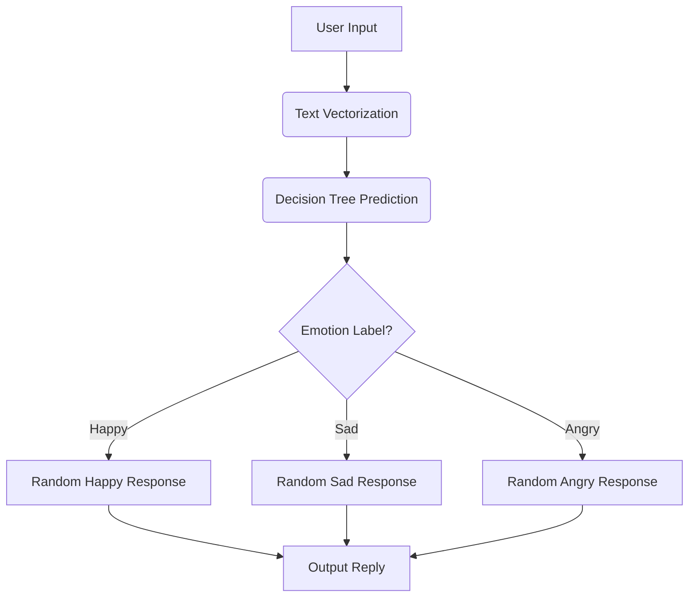

# Real-Time Chatbot with Logic Flow


This is a **simple rule-based chatbot** that responds to user emotions (happy, sad, angry) using **text classification** with a **Decision Tree** model. Below is a detailed breakdown of its logic, workflow, and key concepts.

---

## **1. Program Overview**
- **Purpose**: A chatbot that detects emotions in user text and responds accordingly.
- **Input**: User types a sentence (e.g., "I'm happy").
- **Output**: The bot generates a relevant response (e.g., "That's wonderful!").
- **Key Techniques**:
  - **Text Vectorization** (`CountVectorizer`) – Converts words into numerical features.
  - **Decision Tree Classifier** – Predicts emotion labels (happy/sad/angry).
  - **Rule-Based Responses** – Replies are randomly selected from predefined options.

---

## **2. Key Components**
### **(A) Dataset**
A small **hardcoded dataset** (`data`) containing:
- `text`: Example user inputs (e.g., "I'm happy").
- `response`: Possible bot responses (e.g., "That's wonderful!").
- `label`: Emotion categories (happy, sad, angry).

### **(B) Text Vectorization (`CountVectorizer`)**
- Converts sentences into **bag-of-words (BoW)** numerical vectors.
- Example:
  - Input: `"I'm happy"` → Vector: `[1, 1, 0, 0, ...]` (counts of words like "happy", "I'm", etc.).
- Why? Machine learning models need numbers, not raw text.

### **(C) Decision Tree Classifier**
- A **supervised ML model** trained to classify text into emotions.
- Steps:
  1. `X = vectorizer.fit_transform(df['text'])` → Converts text to numerical features.
  2. `tree.fit(X, df['label'])` → Trains the model on input-label pairs.

### **(D) Chatbot Logic**
1. **User Input**: The user types a sentence.
2. **Prediction**:
   - `input_vec = vectorizer.transform([user_input])` → Converts input to a vector.
   - `label = tree.predict(input_vec)[0]` → Predicts emotion (e.g., "happy").
3. **Response Selection**:
   - Randomly picks a matching response from `df[df['label'] == label]`.

---

## **3. Workflow Diagram**



## **6. How to Run the Code**
### **Dependencies**
```bash
pip install scikit-learn pandas
```
### **Execution**
```bash
python chat_bot.py
```
### **Example Interaction**
```
Chatbot: Hi! How are you feeling? (type 'quit' to exit)
You: I'm sad
Chatbot: I'm sorry to hear that.
You: I love this
Chatbot: That's awesome!
```
